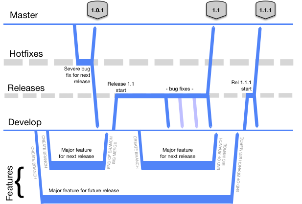
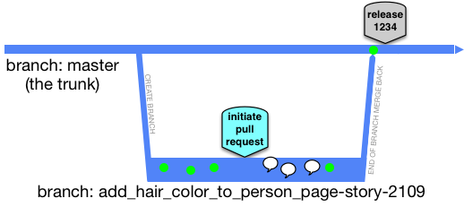
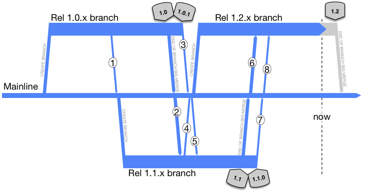
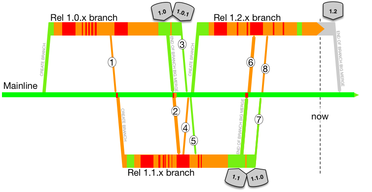
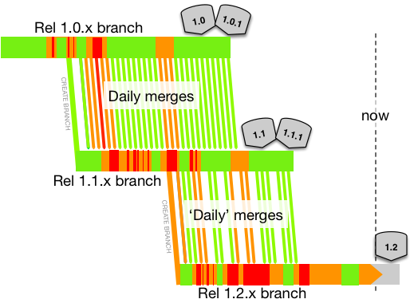


<span>&mdash; Laura Wingerd & Christopher Seiwald</span><br>
<span style="margin-left: 30px">(1998's High-Level SCM Best Practices white paper from Perforce)</span>


## Modern claimed high-throughput branching models

### GitFlow and similar

There are plenty in the modern age that swear by this model, and feel it has plenty of room to scale with few
downsides. It is a branching model that has **groups** of developers active concurrently in more than one branch (or fork).



- Diagram copied from Vincent Driessen's 2010 article on GitFlow: "A successful Git branching model"

I looks like you'll not be able to do [concurrent development of consecutive releases](/concurrent-development-of-consecutive-releases/)
with this branching model, or the hedging that [Feature Flags](/feature-flags/) and [Branch by Abstraction](/branch-by-abstraction/)
enable.

### GitHub flow

This is sooooo close to PR-centric Trunk-Based Development. Why? Because, it is a branching model that has individual
developers active concurrently in more than one (short-lived) branch (or fork). Or developer pairs, rather than
individuals.

The crucial difference is where the release is performed from. 

The GitHub-flow thing showing a release-from-branch step, before the merge back to teh master (trunk):


One problem with is the small risk of regression in a following release - that would be if the release goes out, but 
the branch is never merged back. Another is that it may indeed not have items in it from trunk that were part of a 
previous release (actually causing a regression).

As the GitHub documentation portrays, review comments are part of the process. They are the speech
bubbles in time line above followed by another commit, which presumably addressed the review feedback. 

How Trunk-Based Development modifies the GitHub Flow model:



After the dust has settled, and the short-lived feature branch has been deleted, the commits are not smushed together
in a bigger one (as would be the case Subversion and Perforce), the instead zip into their respective places in the
commit history, which is not as linear as we present here:


Of course if you rebase/squash your series of commits, they could land in the trunk as a single commit.  Also note that
the review commentary is still available after the branch is deleted, as it should be.  

See the GitHub Flow landing page for more

## Legacy branching models

## More than one trunk

You could have a single repository with many trunks (and many branches - release or not). That is not uncommon with VCS
choices that don not have an upper limit on size (including history). You are at least allowing for atomic commits across many
of those trunks, which can happen if you have a large refactoring, and atomic commits are always desirable.

```
root/    
  module_one/
    branches/
      rel_1.0.0/
      rel_1.1.0/          
    trunk/      
      build_file.xml
      src/
        (prod source directory tree)
        (test source directory tree)
  module_two/
    branches/
      rel_1.0.0/
      rel_1.1.0/          
    trunk/      
      build_file.xml
      src/
        (prod source directory tree)
        (test source directory tree)
  module_three/
    branches/
      rel_1.0.0/
      rel_1.1.0/          
    trunk/      
      build_file.xml
      src/
        (prod source directory tree)
        (test source directory tree)
```

Many trunks becomes undesirable if you have the same release cadence for all the separate trunks in the repo, and you 
are 'branching for release', You have made it harder for the larger thing to be build from root. Better would be one, 
trunk with three modules:

```
root/    
  branches/
    rel_1.0.0/
    rel_1.1.0/          
  trunk/      
    module_one/
      build_file.xml
      src/
        (prod source directory tree)
        (test source directory tree)
      module_two/
        build_file.xml
        src/
          (prod source directory tree)
          (test source directory tree)    
      module_three/
        build_file.xml
        src/
          (prod source directory tree)
          (test source directory tree)
```

This way at least, you get to make one branch repesenting the release (with cherry picks to it as bugs are eliminated).

Even if you have different release cadences, you can still engineer a trunk this way, you just have to have a build 
system that can reduce to the modules being tested and deployed, skipping those that won't be. See [Monorepos](/monorepos/)
and [expanding and contracting monorepos](/expanding-contracting-monorepos/).

### Mainline

Mainline is a branching model that was promoted for ClearCase implementations. It is the principal branching
model that Trunk-Based Development opposes. Mainline is a branch that will last forever&#10033;. Off that, branches are formed
for teams to do development work on. When that work is complete, a release may happen from that branch, and there is a
**big** merge down to the mainline. On the way to the release, the branch may be frozen.

So here is the intention, with Mainline:


When bugs inevitably happen:


Whenever there is a bug fix there has to be a merge down to the mainline afterwards. There's no 'wrong' in this modified
branch diagram, but you should be able to guess what the worst case branching/merging scenario is. In case you cannot:



**Merges for the above**

1. Release 1.1 team persuades the release 1.0 team to bring something back to Mainline early (and incomplete) before they cut their branch
1. Release 1.1 team merges the release 1.0 work upon apparent completion
1. Release 1.0 team merges post-release bug fixes back to Mainline, and cross their fingers that the 1.0 branch can truly die now
1. Release 1.2 team persuades the release 1.1 team to bring something back to Mainline early (and incomplete) before they cut their branch
1. Release 1.1 team merges from Mainline, to pick up #3
1. Release 1.2 team merges the release 1.1 work upon apparent completion
1. Release 1.1 team merges post-release bug fixes back to Mainline, and cross their fingers that the 1.0 branch can truly die now
1. Release 1.2 team merges from Mainline, to pick up #7

All of these compromises versus the planned "consecutive development of consecutive releases". In many cases it is worse,
particular when the numbers of developers goes up.

One key thing to note, versus Trunk-Based Development, teams doing the Mainline branching model, almost never do cherry
pick merges for any reason. Instead they're doing a "merge everything which is not merged already" kind of merge.
Minimalistically the VCS they are using should have "merge point tracking". At the high end, that should include
"record only" merges, and normal merges even after that.

&#10033; Companies that choose 'Mainline' wither and die, we claim, so there is no forever.

#### Merges

After the release the code will be merged back en masse to the mainline. Those
merges may be hard and lengthy. It could be that the team **took merges from** mainline part way through the project. It
could also be that the team **pushed merges to** mainline part way through the project.

#### How many branches?

We've just described a two branch model - the mainline and a project branch. It could be that the application in
question has more that one project in flight at any one time. That would mean more than one project branch, and that
creates pressure for more intermediate merges, and consequentially greater merge difficulty.

#### Always release ready?

Not on your life! Planned work needs to complete, with estimates guiding when that will be. Defects need to be
eliminated, formal testing phases need to kick in. Here we take the first branch diagram, and overlay red and orange
and green to show known build-breaks, build passes missing automated tests will not catch hidden defects,
and green for could go live. At least for the worst performing with missing or ineffectual automated
testing run in the CI pipelines:



### Cascade

The idea is that each release has its own branch, and that each release team merges from the 'upstream' branch daily.
They only do so if the CI server says the build is green for the upstream, of course.


Problems compound with this model, the more releases being juggled concurrently there are. An upstream butterfly, is
a downstream Tsunami of unmergability. Downstream merged begin to get skipped, or abandoned. Or the merge works, but the
code is not right so there is some in-branch fixing, which is not applicable to upstream. Here's the reality (breakages
overlaid again):



Remember, the merges are never cherry-picks in this model - they are sweeps of everything
not merged yet (or upto an chosen commit number in order to make it more bite sized).

Of course only larger organizations have to worry
about [concurrent development of consecutive releases](/concurrent-development-of-consecutive-releases/), and many
would argue that the application is too large anyway (and that microservices is the solution).

## CI (dis)proof of your branching model

Here's an idea. Configure your CI Server to focus on every branch, regardless of branching model. Specifically to do
per-commit builds, and do that speculative merge analysis described in [game changers](/game-changers/index.html#snap-ci-s-per-commit-speculative-mergeability-analysis-2013).

If everything is green everywhere, then you're in a position to always be release ready, but very few teams are going
to see green instead of red for this CI server enthusiasm

# References elsewhere

<a id="showHideRefs" href="javascript:toggleRefs();">show references</a>

<div>
    <table>
        <tr>
            <td valign="top">04 Dec 2013, Blog Entry</td>
        </tr>
        <tr>
            <td valign="top"><a href="http://paulhammant.com/2013/12/04/what_is_your_branching_model/">What is Your Branching Model?</a></td>
        </tr>
    </table>
    <table>
        <tr>
            <td valign="top">05 Apr 2013, Blog Entry</td>
        </tr>
        <tr>
            <td valign="top"><a href="http://paulhammant.com/2013/04/05/what-is-trunk-based-development/">What is Trunk-Based Development?</a></td>
        </tr>
    </table>
    <table>
        <tr>
            <td valign="top">19 Mar 2013, Blog Entry</td>
        </tr>
        <tr>
            <td valign="top"><a href="http://paulhammant.com/2013/03/19/cost-of-unmerge/">The Cost of Unmerge</a></td>
        </tr>
    </table>
    <table>
        <tr>
            <td valign="top">15 Oct 2015, InfoQ Interview</td>
        </tr>
        <tr>
            <td valign="top"><a href="https://www.infoq.com/news/2015/10/branching-continuous-integration">More Feature Branching Means Less Continuous Integration</a></td>
        </tr>
    </table>
    <table>
        <tr>
            <td valign="top">03 May 2015, Blog Entry</td>
        </tr>
        <tr>
            <td valign="top"><a href="http://endoflineblog.com/gitflow-considered-harmful">GitFlow considered harmful</a></td>
        </tr>
    </table>
    <table>
        <tr>
            <td valign="top">08 Jan 2016, Blog Entry</td>
        </tr>
        <tr>
            <td valign="top"><a href="http://dan.bodar.com/2016/01/08/gitflow-hmmmm/">GITFLOW HMMMM</a></td>
        </tr>
    </table>
</div>

