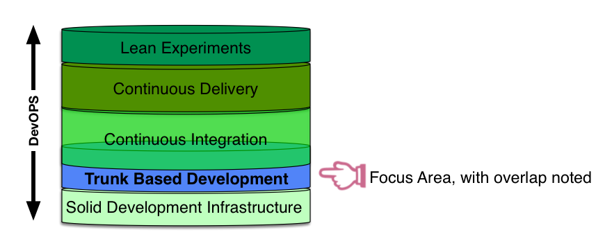

A development team wanting to go ahead with Trunk-Based Development have pre-requisite achievements. Once the team has 
done a few commits in the correct style, other things are now facilitated. We can show this as a layer cake:

DevOps is encompassing too. At the very least, the expansion of development best practices into operations heartlands.

## Trunk-Based Development pre-requisites

(layers below it)

Installation of your VCS technology is part of a foundational development infrastructure that includes developer 
workstations or laptops that are appropriate for build testing and running of the application or service being made.
Developers running the application only need it to be functionally viable. It doesn't have to match the performance
of the expected production environment, and it is OK for it to be non-functionally different in other ways too.

In the modern DevOps era, this probably means Infrastructure as Code. 

## Trunk-Based Development facilitates

(layers above it)

### Continuous Integration

[Continuous Integration](/continuous-integration/) (CI) has been in practice since the
mid-nineties in its modern incarnation (integrating to a shared code line frequently and 
testing that).

Importantly, the reader should understand that there is a large overlap between Trunk-Based Development and 
Continuous Integration, as defined by its definers and documenters. Whereas Trunk-Based Development focuses on a
pure source-control workflow and an individual contributor's obligations to that, Continuous Integration focuses 
equally on that and the need to have machines issue early warnings on breakages and incompatibilities.

### Continuous Delivery

[Continuous Delivery](/continuous-delivery/) (CD) is a layer on top of that, has been practiced since the mid-2000's, and 
documented in Jez Humble and Dave Farley's book of the same name in 2010.  This site gives a 5% summary of the 
practice. The reader should dive into the Book and associated site, without delay.

### Lean Experiments

With CD locked in, continual improvement experiments can happen with a focus on time through "the machine" that is your 
development and delivery operation. The experiments should draw off the field of science that is "Lean" so that the 
impact of each experiment can be measured against predictions and decisions made appropriately following it.

Lean Experiments can happen in any development team on any project but work **best** on foundations that 
are solid. Specifically, the solid foundations of Trunk-Based Development, CI, and CD. 

This site does not touch on Lean Experiments beyond this section, but the reader should strive to understand that field
of science when the lower layers of the stylized cake are solid.
