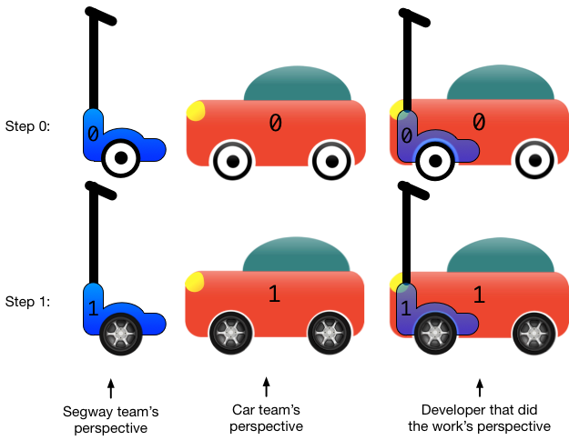

## Expandable and Contractible Checkouts 
 
As some point with a Monorepo approach to source control (especially with binary dependencies in the source tree), your checkouts 
could be bigger than your local workstation's hard drive. Or even if the checkout is not too big for your hard drive, 
then it might be too much for your IDE, and you do not want to have to abandon it for Vim/Emacs. Or maybe it isn't IDE that 
chokes is is something about the build that's too much locally, despite command line arguments to attempt to
pare it down for a shorter elapsed time.

There is a way to intelligently expand or contract the checkout on you developer workstation, to alleviate all of 
the above.

### Gcheckout.sh

Google's in-house DevOps uses some simple scripting to
modify the checkout on the developer's workstation to omit the source files/packages that are not needed for the 
current intentions of the developer. This Blaze related technology is a shell command called 'gcheckout'. It can modify the mappings between the multi-gigabyte HEAD 
revision of company-wide trunk (monorepo) and developer's own workstation. Thus the source-control tools maintain the 
**smallest possible subset** of the monorepo on the developer's workstation, for them to perform their daily work. 
Google and the industry refer to the general feature as 'sparse checkout'.

You can run gcheckout at any time to modify your sparse checkout to be bigger or smaller (or wholly different) for 
different reasons. All of those are operations on your local representation of a larger trunk.

### Contrived example of use

We detailed two intentions for directed graph build systems above, using a contrived application. Here is one more:

* I now want to change `TheORMweDepOn`, because a change to `MyTeamsApplication` needs me to do that.

In Google, rather than feed into the backlog of the team that maintains `TheORMweDepOn` (which may exist as a part-time 
committee rather than a team), the developer in question would make the change themselves. Perhaps they had made 
it in the same commit as the first usage of it for `MyTeamsApplication`.  In the code review cycle (Google do
common code ownership), the approvers for the `TheORMweDepOn` would see all the changes together. The larger change is 
all accepted or rejected (to be remediated) atomically.

So our developer was working on `MyTeamsApplication`, which depended on `TheORMweDepOn` (which probably transitively 
depended on other things). Now that developer is going to change `TheORMweDepOn` and that impacts `TheirApplication` 
too. The Blaze related checkout-modifying technology performs an expansion to bring in `TheirApplication` to the 
developer's checkout. From that moment on, the developer doing update/pull/sync will bring down minute by minute
changes to those three modules.  For free, the build expands to make sure that the `TheORMweDepOn` changes do not 
break either of `MyTeamsApplication` or `TheirApplication`.
 
### Contrived example of use #2

We used 'change the wheel on a car', on the [Branch By Abstraction](/branch-by-abstraction/) page for its contrived 
example. It will serve us again here. The wheel is what we want to change. The other team using 'Wheel(s)' is making a 
Segway thing (two wheels and self-balancing via high-torque and very responsive motors). Here's the procedure:

  
 
The starting position is two teams working separately, using 'Wheel' (4 for car, 2 for Segway). Without any commits 
happening the engineer changing 'Wheel' for everyone, runs gcheckout (or its equivalent) to modify the source in the 
IDE to the union of Car and Segway (and in-house dependencies). That is marked as step 0. Lets say the
change is quick/easy this time (not requiring Branch By Abstraction) step 1 shows the single commit that changes
wheel for everyone.  After the commit/push, running again shows the application focused team checkout - either 
'Car' or 'Segway'.
 
### Git's Sparse checkouts

Git has a 'sparse checkout' capability, which exactly facilitates this sort of thing. Subversion and Mercurial do too.  
Perforce has a 'client spec' capability that is more or less the same. A team wanting to have their own gcheckout equivalent
would have some scripting around sparse checkouts (or equivalent). 
 
#### Using Git this way today

If you're willing to go a 'split history' maneuver on your monorepo once or twice a year, Git can do the expandable and 
contractible monorepo setup today. 

### Perforce's client-specs

Perforce has a 'client spec' (alternatively 'view') that is accessed via the client command or UI. Amongst other things, it 
allows a checkout to be a subset of the directories/files available within the branch. A list of globbed includes and 
excludes is the format. You would script this (as Google did until 2012) to have a directed graph driven 
expandable/contractible checkout.

### PlasticSCM's cloadked.conf

As Perforce, but via 'cloaked.conf' file.

### Subversion's sparse-checkouts

Subversion has a 'sparse checkout' capability. You do a series of checkout operations at various directory levels in order
to create the mapping, so is less atomic or centrally configured than the others.

